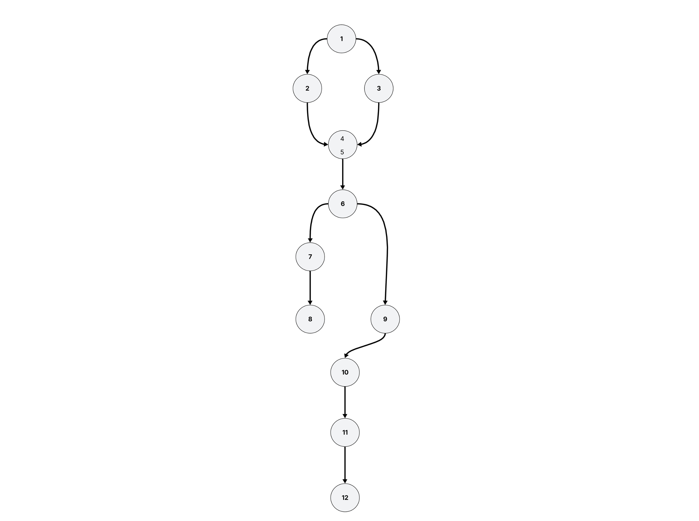
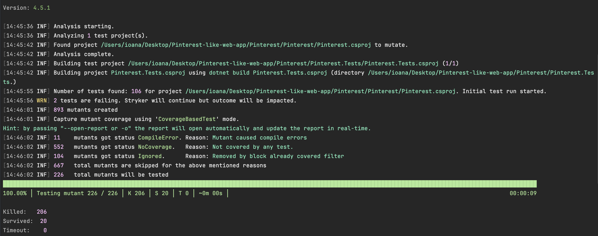
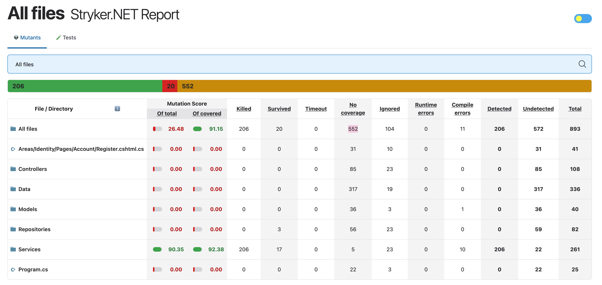

### A Pinterest-inspired app developed in ASP.NET/C#, using MVC architecture and a SQL Server database.
- It lets the authenticated user share photos, videos, GIFs, and comments, as well as like and save posts to personalized collections/boards on their profile. They can also edit or delete their previous posts, comments or collections/boards. 
- A guest user can see posts and comments from authenticated users, but they can't post, comment, like or have their own collections/boards. 
- The admin user can only delete posts or comments from any authenticated user.

### A demonstration provided for each type of user:
### Guest user
https://github.com/BiancaDogareci/Social_Bookmarking_Web_Application/assets/119197457/6cc14787-a29f-4b20-a0c3-d22f2622c8c8

### Authenticated user
https://github.com/BiancaDogareci/Social_Bookmarking_Web_Application/assets/119197457/bdb513b8-0673-4d5d-8705-c6712c2f565d

### Admin user
https://github.com/BiancaDogareci/Social_Bookmarking_Web_Application/assets/119197457/abe527ed-4ee7-4cf6-994b-708b4644c30f

## Componență echipă

[Dogăreci Bianca Alexandra](https://github.com/BiancaDogareci)

[Potlog Ioana](https://github.com/ioanapotlog)

## Definirea obiectivului

Proiectul are ca scop testarea unitară a serviciilor backend dezvoltate în cadrul unei aplicații de tip social bookmarking, similară cu Pinterest. Serviciile vizate sunt componente esențiale ale aplicației, precum: 
- autentificarea unui utilizator ca USER sau ADMIN;
- crearea, editarea, ștergerea pin-urilor;
- afișarea paginată a pin-urilor ordonate după like-uri, in funcție de search;
- afișarea paginată a pin-urilor ordonate după dată, in funcție de search;
- toggle pin like;
- crearea, editarea, ștergerea categoriilor;
- salvarea unui pin într-o categorie;
- adăugarea, editarea și ștergerea de comentarii.

Pentru implementarea și testarea proiectului, au fost utilizate tehnologii precum C#, ASP.NET Core pentru backend, xUnit ca framework de testare și Moq pentru simularea dependențelor.


## Alegerea framework-ului de testare C# - XUnit [[1]](#referințe)

Pentru testarea aplicației noastre, am ales framework-ul xUnit deoarece oferă o serie de avantaje adaptate proiectelor moderne dezvoltate în ASP.NET versiunea 6+.

### Avantajele:
1. Integrare excelentă cu .NET Core
- xUnit este dezvoltat de aceeași echipă care a lucrat la ASP.NET Core și .NET Core;
- Funcționează perfect cu SDK-urile moderne: .NET 6, .NET 7, .NET 8);
2. Design modern și clar
- Setup-ul testelor se face simplu;
- Codul de testare e mai curat și mai ușor de înțeles;
3. Teste rulate în paralel
- xUnit rulează testele în paralel automat, ceea ce ajută la reducerea timpului total de execuție;
- Este util pentru proiectul nostru, deoarece avem destul de multe teste;
4. Suport bun
- Este compatibil cu multe tool-uri moderne (ex: Moq, dotnet test etc.);

### De ce NU am ales NUnit?
- Este mai potrivit pentru aplicații legacy sau foarte complexe, care folosesc deja NUnit;
- Necesită mai multă configurare și oferă suport avansat pentru testare parametrică, de care nu aveam nevoie în acest proiect;
- Structura cu multe atribute face codul mai greu de citit comparativ cu xUnit;

### De ce NU am ales MSTest?
- Este mai vechi.
- Comparativ cu xUnit, este mai puțin flexibil și mai greu de extins;

## Dependențe

### Pinterest.csproj:
```
<!-- Pentru aplicatie ASP.NET Core -->
<Project Sdk="Microsoft.NET.Sdk.Web">

  <PropertyGroup>
    <TargetFramework>net6.0</TargetFramework>
    <Nullable>enable</Nullable>
    <ImplicitUsings>enable</ImplicitUsings>
    <UserSecretsId>aspnet-Pinterest-0870c269-c934-441d-a61d-2ff3c9d6286c</UserSecretsId>
  </PropertyGroup>

  <ItemGroup>
    <!-- Diagnostica erori EF Core in development -->
    <PackageReference Include="Microsoft.AspNetCore.Diagnostics.EntityFrameworkCore" Version="6.0.22" />
    
    <!-- ASP.NET Identity integrat cu EF Core (user management) -->
    <PackageReference Include="Microsoft.AspNetCore.Identity.EntityFrameworkCore" Version="6.0.22" />
    
    <!-- Interfata grafica pentru autentificare (login/register UI) -->
    <PackageReference Include="Microsoft.AspNetCore.Identity.UI" Version="6.0.22" />
    
    <!-- Conectare la SQL Server -->
    <PackageReference Include="Microsoft.EntityFrameworkCore.SqlServer" Version="6.0.22" />
    
    <!-- Unelte pentru migratii EF Core -->
    <PackageReference Include="Microsoft.EntityFrameworkCore.Tools" Version="6.0.22" />
  </ItemGroup>

</Project>
```

### Pinterest.Tests.csproj:
```
<!-- Pentru proiect de testare unitara -->
<Project Sdk="Microsoft.NET.Sdk">

  <PropertyGroup>
    <TargetFramework>net8.0</TargetFramework>
    <ImplicitUsings>enable</ImplicitUsings>
    <Nullable>enable</Nullable>
    <IsPackable>false</IsPackable>
    <IsTestProject>true</IsTestProject>
  </PropertyGroup>

  <ItemGroup>
    <!-- Ruleaza testele .NET -->
    <PackageReference Include="Microsoft.NET.Test.Sdk" Version="17.8.0" />
    
    <!-- Framework de testare xUnit -->
    <PackageReference Include="xunit" Version="2.5.3" />
    
    <!-- Runner pentru xUnit in Visual Studio / CLI -->
    <PackageReference Include="xunit.runner.visualstudio" Version="2.5.3" />
    
    <!-- Code coverage collector (coverlet) -->
    <PackageReference Include="coverlet.collector" Version="6.0.0" />
    
    <!-- Mocking library pentru testare unitara -->
    <PackageReference Include="Moq" Version="4.20.72" />
  </ItemGroup>

  <ItemGroup>
    <!-- Leaga proiectul de testare de aplicatia principala -->
    <ProjectReference Include="..\Pinterest\Pinterest.csproj" />
  </ItemGroup>

</Project>
```


## Configurarea și rularea testelor unitare [[3]](#referințe)
### 1. Rularea testelor din terminal cu "dotnet test"
- Deschide terminalul în folderul soluție.
- Rulează comanda:
```
dotnet test
```
- Vei vedea in consolă:
    - Testele care au trecut sau eșuat;
    - Timpul de execuție;

### 2. Rularea testelor din IDE
- Deschide fișierul de test în Visual Studio sau Rider.
- Lângă fiecare [Fact] (test individual) sau clasă, apare un buton verde.
- Apasă-l pentru a rula un test individual sau toate testele din clasă.
- Poți folosi și panoul de testare (Test Explorer în Visual Studio, Unit Tests în Rider) pentru:
    - Vizualizare rapidă a rezultatelor;
    - Re-run, debug sau filtrare a testelor.

### Rularea Testelor Demo:

https://github.com/user-attachments/assets/d7559d29-8864-4700-b563-0feb710ec193


## Strategii de testare - Teorie + Exemple

### 1. Testare funcțională [[4]](#referințe)

### Exemplu:

Se testează funcția GetPins(string search, int page, int perPage), care returnează o listă paginată de pin-uri, filtrată opțional după un cuvânt cheie (search) și ordonată descrescător după LikesCount. Mai precis, pentru un search (care poate fi null, gol sau un text), o valoare întreagă page >= 1 și <= n (ceil(nr pins / perPage)) și un perPage >= 1, funcția caută pin-urile corespunzătoare și le ordonează descrescător după numărul de aprecieri (LikesCount). În cazul în care search este specificat, sunt afișate pin-urile care conțin respectivul cuvânt în titlu, descriere sau comentarii. Funcția returnează doar pin-urile corespunzătoare paginii cerute, împreună cu numărul ultimei pagini (LastPage) și un URL construit pentru navigare (PaginationUrl). Funcția verifică dacă valorile pentru page (< 1 sau > n) sau perPage (< 1) sunt invalide, iar dacă cel puțin una este invalidă, aceasta nu execută căutarea și returnează o listă goală cu LastPage egal cu 0 și un URL construit în funcție de search. Funcția este apelată de fiecare dată când utilizatorul caută un cuvânt nou sau navighează la o pagină diferită.

Pentru exemplul nostru avem:
- avem ```m``` pin-uri în total;
- folosim ```perPage``` pentru a decide câte pin-uri apar pe o pagină;
- numărul total de pagini este ```n = ceil(m / perPage)```;

### a) Partiționare de echivalență
Ideea de bază este de a partiționa domeniul problemei (datele de intrare) în clase de echivalență astfel încât, din punctul de vedere al specificației datele dintr-o clasă sunt tratate în mod identic.

### Domeniul de intrări:

Exista 3 intrări:
- un string ```search```;
- un întreg ```page```;
- un întreg ```perPage```;
- ```search``` poate să fie null, gol sau un text, toate fiind valide, deci nu determină clase de echivalență suplimentare;
  - S_1 = { null, "", "text" }
- ```page``` trebuie să fie >= 1 și <= n, deci se disting 3 clase de echivalență:
  - P_1 = 1...n
  - P_2 = {page | page < 1}
  - P_3 = {page | page > n}
- ```perPage``` trebuie să fie >= 1, deci se disting 2 clase de echivalență:
  - PP_1 = {perPage | perPage < 1}
  - PP_2 = {perPage | perPage >= 1}

### Domeniul de ieșiri:

Funcția returnează un tuplu cu următoarele 3 componente:
- o listă de pin-uri```Pins```afișate pentru pagina curentă;
- un întreg pozitiv ```LastPage``` care reprezintă numărul ultimei pagini disponibile;
- un string ```PaginationUrl``` care reprezintă adresa URL pentru navigarea între pagini.

Constă în următoarele răspunsuri:
- dacă parametrii page >= 1 și <= n și perPage >= 1, funcția returnează o listă de pinuri corespunzătoare paginii cerute, alături de numărul ultimei pagini și un URL de paginare;
- dacă page (< 1 sau > n) sau perPage (< 1) este invalid, funcția returnează o listă goală, LastPage egal cu 0 și un URL de paginare;

Acestea sunt folosite pentru a împărți domeniul de intrare în 2 clase: una pentru cazul în care page și perPage sunt >= 1 și page <= n și una pentru cazul în care page sau perPage este invalid (< 1 sau page > n):

C_1(page, perPage) = {l, lp, url | page >= 1 și perPage >= 1 și page <= n};

C_2(page, perPage) = {[], 0, url | page < 1 sau perPage < 1 sau page > n};

Clasele de echivalență pentru întregul program (globale) se pot obține ca o combinatie a claselor individuale:

C_111 = {(search, page, perPage) | search ∈ S_1, page ∈ P_1, perPage ∈ PP_1}

C_112 = {(search, page, perPage) | search ∈ S_1, page ∈ P_1, perPage ∈ PP_2}

C_121 = {(search, page, perPage) | search ∈ S_1, page ∈ P_2, perPage ∈ PP_1}

C_122 = {(search, page, perPage) | search ∈ S_1, page ∈ P_2, perPage ∈ PP_2}

C_132 = {(search, page, perPage) | search ∈ S_1, page ∈ P_3, perPage ∈ PP_2}

Setul de date de test se alcătuiește alegându-se o valoare a intrărilor pentru fiecare clasă de echivalență. De exemplu, pentru m = 10 și n = ceil(m / perPage):

c_111 = ("example", 2, -1)

c_112 = ("example", 3, 2)

c_121 = (null, 2, 0)

c_122 = ("", 0, 2)

c_132 = ("", 6, 3)

5 clase

| search     | page | perPage | Rezultat așteptat (expected)                    |
|------------|------|---------|-------------------------------------------------|
| "example"  | 2    | -1      | Returnează listă goală + LastPage = 0 + URL     |
| "example"  | 3    | 2       | Returnează pin-urile paginate + LastPage + URL  |
| null       | 2    | 0       | Returnează listă goală + LastPage = 0 + URL     |
| ""         | 0    | 2       | Returnează listă goală + LastPage = 0 + URL     |
| ""         | 6    | 3       | Returnează listă goală + LastPage = 0 + URL     |


### b) Analiza valorilor de frontieră
Analiza valorilor de frontieră este folosită de obicei împreuna cu partiționarea de echivalență. Ea se concentrează pe examinarea valorilor de frontieră ale claselor, care de obicei sunt o sursă importanta de erori.

Odată ce au fost identificate clasele, valorile de frontieră sunt ușor de identificat:
- valorile 0, 1, n, n+1 pentru ```page```;
- valorile 0, 1 pentru ```perPage```;

Deci se vor testa următoarele valori:
- P_1: 1, n
- P_2: 0
- P_3: n + 1
- PP_1: 0
- PP_2: 1
- Pentru S_1 se ia câte o valoare arbitrară

C_111 = ("example", 1, 0)

C_112 = ("example", 1, 1) ("example", 10, 1)

C_121 = (null, 1, 0)

C_122 = ("", 0, 1)

C_132 = ("", 11, 1)

| search     | page | perPage | Rezultat așteptat (expected)                                           |
|------------|------|---------|------------------------------------------------------------------------|
| "example"  | 1    | 0       | perPage invalid, listă goală, LastPage = 0, URL                        |
| "example"  | 1    | 1       | Returnează primele pinuri, LastPage calculat, URL valid                |
| "example"  | 10   | 1       | Returnează ultimele pinuri, LastPage = 10, URL valid                   |
| null       | 1    | 0       | perPage invalid, listă goală, LastPage = 0, URL                        |
| ""         | 0    | 1       | page invalid, listă goală, LastPage = 0, URL                           |
| ""         | 11   | 1       | page > LastPage, listă goală, LastPage = 0, URL                        |


### c) Partiționarea în categorii
Această metodă se bazează pe cele două anterioare. Ea caută să genereze date de test care “acoperă" funcționalitatea sistemului și maximizeaza posibilitatea de găsire a erorilor.

Pentru exemplul nostru:

1. Descompune specificatia în unități: funcția GetPins() reprezintă o singură unitate.
2. Identifică parametrii: search, page, perPage.
3. Găsește categorii:
  - search: orice valoare validă (null, "", "text");
  - page: dacă este în intervalul valid 1...n;
  - perPage: dacă este validă, adică >= 1;
4. Partiționeaza fiecare categorie în alternative:
  - page: < 0, 0, 1, 2..n-1, n, n+1, > n+1;
  - perPage: < 0, 0, 1, > 1;
5. Scrie specificația de testare
  - search:
    1) search = null || "" || "text" [ok]
  - page: 
    1) {page | page < 0}
    2) 0
    3) 1  [if ok and minim_valid]
    4) 2...n-1 [if ok and pagină_intermediară]
    5) n  [if ok and maxim_valid]
    6) n+1
    7) {page | page > n+1}
  - perPage: 
    1) {perPage | perPage < 0}
    2) 0
    3) 1 [if ok and minim_valid]
    4) {perPage | perPage > 1} [if ok and valid_extins]

Din specificația de testare ar trebui să rezulte 1 x 7 x 4 = 28 de cazuri de testare. Pe de altă
parte, unele combinații de alternative nu au sens și pot fi eliminate. Acest lucru se poate face
adăugând constrângeri acestor alternative. Constrângerile pot fi sau proprietăți ale alternativelor sau condiții de selectie bazate pe aceste proprietăți.  În acest caz, alternativele vor fi combinate doar dacă condițiile de selecție sunt satisfacute. 

Aplicând aceste constrângeri și eliminând combinațiile invalide sau redundante, numărul cazurilor de testare se reduce la aproximativ 12 cazuri reprezentative.

6. Creează cazuri de testare

s1p1&nbsp;&nbsp;&nbsp;&nbsp;s1p2&nbsp;&nbsp;&nbsp;&nbsp;s1pp1&nbsp;&nbsp;&nbsp;&nbsp;s1pp2&nbsp;&nbsp;&nbsp;&nbsp;s1p3pp3&nbsp;&nbsp;&nbsp;&nbsp;s1p3pp4&nbsp;&nbsp;&nbsp;&nbsp;s1p4pp3&nbsp;&nbsp;&nbsp;&nbsp;s1p4pp4&nbsp;&nbsp;&nbsp;&nbsp;s1p5pp3&nbsp;&nbsp;&nbsp;&nbsp;s1p5pp4&nbsp;&nbsp;&nbsp;&nbsp;s1p6&nbsp;&nbsp;&nbsp;&nbsp;s1p7

1. Creează date de test

| ID         | search      | page | perPage | Rezultat așteptat (expected)            |
|------------|-------------|------|---------|-----------------------------------------|
| s1p1       | "test"      | -1   | 1       | listă goală + LastPage = 0 + URL        |
| s1p2       | null        | 0    | 2       | listă goală + LastPage = 0 + URL        |
| s1pp1      | "test"      | 1    | -1      | listă goală + LastPage = 0 + URL        |
| s1pp2      | ""          | 1    | 0       | listă goală + LastPage = 0 + URL        |
| s1p3pp3    | null        | 1    | 1       | pin-uri paginate + LastPage = 10 + URL  |
| s1p3pp4    | "abc"       | 1    | 2       | pin-uri paginate + LastPage = 10 + URL  |
| s1p4pp3    | "search"    | 3    | 1       | pin-uri paginate + LastPage = 10 + URL  |
| s1p4pp4    | null        | 3    | 3       | pin-uri paginate + LastPage = 10 + URL  |
| s1p5pp3    | "x"         | 10   | 1       | pin-uri paginate + LastPage = 10 + URL  |
| s1p5pp4    | "test"      | 10   | 2       | listă goală + LastPage = 0 + URL        |
| s1p6       | "query"     | 11   | 2       | listă goală + LastPage = 0 + URL        |
| s1p7       | "pin"       | 13   | 2       | listă goală + LastPage = 0 + URL        |


### 2. Testare structurală [[5]](#referințe)

### Graful de flux de control (Control Flow Graph - CFG)

```
public (IEnumerable<Pin> Pins, int LastPage, string PaginationUrl) GetPins(string search, int page, int perPage)
{
    IQueryable<Pin> pins = string.IsNullOrWhiteSpace(search)
        ? _repo.GetAllPinsOrderedByLikes()
        : _repo.GetPinsBySearch(search);

    int totalItems = pins.Count();
    int lastPage = (int)Math.Ceiling((float)totalItems / perPage);

    if (perPage <= 0 || page <= 0 || page > lastPage)
    {
        return (new List<Pin>(), 0, string.IsNullOrWhiteSpace(search)
            ? "/Pins/Index/?page"
            : $"/Pins/Index/?search={search}&page");
    }

    int offset = (page - 1) * perPage;

    var paginatedPins = pins.Skip(offset).Take(perPage).ToList();
    string url = string.IsNullOrWhiteSpace(search)
        ? "/Pins/Index/?page"
        : $"/Pins/Index/?search={search}&page";

    return (paginatedPins, lastPage, url);
}
```



### Instrucțiuni cheie:

- **1**: `if (string.IsNullOrWhiteSpace(search))`
- **2**: `GetAllPinsOrderedByLikes`
- **3**: `GetPinsBySearch`
- **4**: `totalItems = pins.Count`
- **5**: `lastPage = (int)Math.Ceiling((float)totalItems / perPage);`
- **6**: `if (perPage <= 0 || page <= 0  || page > lastPage)`
- **7**: `if (string.IsNullOrWhiteSpace(search))`
- **8**: `return early (empty list, page = 0, search)`
- **9**: `offset = (page - 1) * perPage`
- **10**: `paginatedPins = Skip + Take`
- **11**: `if (string.IsNullOrWhiteSpace(search))`
- **12**: `return (paginatedPins, lastPage, url)`

### a) Acoperire la nivel de instrucțiune (Statement coverage)

Pentru a obține o acoperire la nivel de instrucțiune, trebuie să ne concentram asupra acelor
instrucțiuni care sunt controlate de condiții (acestea corespund ramificațiilor din graf)

| **Intrări**                                 | **Rezultat așteptat**                              | **Instrucțiuni parcurse**       |
|---------------------------------------------|----------------------------------------------------|---------------------------------|
| `search = ""`, `page = 0`, `perPage = 2`    | Listă goală, LastPage = 0, URL                     | 1, 2, 4, 5, 6, 7, 8             |
| `search = "tag"`, `page = 1`, `perPage = 2` | Listă filtrată, LastPage != 0, URL cu search       | 1, 3, 4, 5, 6, 9, 10, 11, 12    |


### b) Acoperire la nivel de decizie (Decision coverange)
Este o extindere naturală a metodei precedente.

Genereaza date de test care testează cazurile când fiecare decizie este adevărată sau falsă.

|     | **Decizii**                                        |
|-----|----------------------------------------------------|
| (1) | if (string.IsNullOrWhiteSpace(search))             |
| (2) | if (perPage <= 0 or page <= 0  or page > lastPage) |
| (3) | if (string.IsNullOrWhiteSpace(search))             |


| search     | page | perPage | **Rezultat așteptat**                          | **Decizii acoperite**                 |
|------------|------|---------|------------------------------------------------|---------------------------------------|
| ""         | 0    | 2       | listă goală, LastPage = 0, URL                 | (1) = true, (2) = true                |
| "test"     | 1    | 0       | listă goală, LastPage = 0, URL cu search       | (1) = false, (2) = true               |
| "test"     | 1    | 2       | pin-uri paginate, LastPage != 0, URL cu search | (1) = false, (2) = false, (3) = false |
| null       | 1    | 2       | pin-uri paginate, LastPage != 0, URL           | (1) = true, (2) = false, (3) = true   |


### c) Acoperire pe condiții (Condition coverage)
Genereaza date de test astfel încat fiecare condiție individuală dintr-o decizie să ia atât valoarea adevărat cât și valoarea fals (dacă acest lucru este posibil).

|     | **Decizii**                                         | **Condiții individuale**                           |
|-----|-----------------------------------------------------|----------------------------------------------------|
| (1) | if (string.IsNullOrWhiteSpace(search))              | search = {null, ""}                                |
| (2) | if (perPage <= 0 or page <= 0  or page > lastPage)  | (perPage <= 0) (page <= 0) (page > lastPage)       |
| (3) | if (string.IsNullOrWhiteSpace(search))              | search = {null, ""}                                |


| search     | page | perPage | Rezultat afișat                                            | Condiții individuale acoperite                                                                |
|------------|------|---------|------------------------------------------------------------|-----------------------------------------------------------------------------------------------|
| "text"     | 0    | 2       | Returnează listă goală + LastPage = 0 + URL cu search      | search != "", search != null, page <= 0 (true), perPage <= 0 (false), page > lastPage (false) |
| ""         | 0    | 2       | Returnează listă goală + LastPage = 0 + URL                | search = "", page <= 0 (true), perPage <= 0 (false), page > lastPage (false)                  |
| "test"     | 1    | 0       | Returnează listă goală + LastPage = 0 + URL cu search      | search != "", search != null, page <= 0 (false), perPage <= 0 (true), page > lastPage (false) |
| null       | 1    | 0       | Returnează listă goală + LastPage = 0 + URL                | search = null, page <= 0 (false), perPage <= 0 (true), page > lastPage (false)                |
| "test"     | 6    | 2       | Returnează listă goală + LastPage = 0 + URL cu search      | search != "", search != null, page <= 0 (false), perPage <= 0 (false) page > lastPage (true)  |
| ""         | 6    | 2       | Returnează listă goală + LastPage = 0 + URL                | search = "", page <= 0 (false), perPage <= 0 (false) page > lastPage (true)                   |
| null       | 1    | 2       | Returnează pinuri paginate + LastPage + URL                | search = null, page <= 0 (false), perPage <= 0 (false) page > lastPage (false)                |
| "test"     | 1    | 2       | Returnează pinuri paginate + LastPage + URL cu search      | search != "", search != null, page <= 0 (false), perPage <= 0 (false) page > lastPage (false) |


### d) Testarea circuitelor independente + Complexitate ciclomatică (McCabe)
Acesta este o modalitate de a identifica limita superioară pentru numărul de căi necesare pentru obținerea unei acoperiri la nivel de ramură.

Se bazează pe formula lui McCabe pentru Complexitate Ciclomatică. Dat fiind un graf complet conectat G cu e arce și n noduri, atunci numărul de circuite linear independente este dat de: V(G) = E – N + 1.

Formula simplificată: V(G) = E − N + 2.

Pentru a forma circuitele am adaugat 2 muchii (8, 1) și (12, 1).

- Noduri: 11;
- Muchii: 11 + 2 = 13;

V(G) = 13 - 11 + 2 = 4

Avem 4 circuite independente:

a) 1, 2, 4, 5, 6, 7, 8, 1

b) 1, 3, 4, 5, 6, 7, 8, 1

c) 1, 2, 4, 5, 6, 9, 10, 11, 12, 1

d) 1, 3, 4, 5, 6, 9, 10, 11, 12, 1


## Mutation testing

Mutation testing este o tehnică de testare care evaluează calitatea unui set de teste prin introducerea a unor mici modificări (numite mutanți) în codul sursă, apoi verificând dacă testele detectează acele modificări.

Am ales **Stryker.NET**[[6]](#referințe) pentru că e cel mai potrivit framework de mutation testing în C# și funcționează bine cu proiecte ASP.NET. Acesta ne ajută să evaluăm cât de eficient acoperă testele unitare codul aplicației noastre și pentru a identifica eventualele puncte slabe din testare. În plus, **Stryker.NET** se integrează ușor cu testele scrise în **xUnit**. 

Prin utilizarea sa, am putut măsura nu doar dacă codul este acoperit de teste, ci și cât de relevante sunt aceste teste, având un indicator concret al calității testării noastre.

### Configurarea și rularea testelor cu mutanți[[7]](#referințe)

Instalare globală
```
dotnet tool install -g dotnet-stryker
```

Running Stryker
```
cd ...Pinterest.Tests
dotnet stryker
```



Deschiderea Stryker.NET Report

```
open ./StrykerOutput/2025-04-15.14-45-35/reports/mutation-report.html
```




## Raport despre folosirea unui tool AI (ChatGPT)


## Referințe

[1] Robert Dennyson, [Choosing the Right Testing Framework for .NET Applications](https://medium.com/@robertdennyson/xunit-vs-nunit-vs-mstest-choosing-the-right-testing-framework-for-net-applications-b6b9b750bec6), Data ultimei accesări: 6 aprilie 2025

[2] Tong Eric, [Guide to Implementing xUnit Tests in C# .NET](https://medium.com/bina-nusantara-it-division/a-comprehensive-guide-to-implementing-xunit-tests-in-c-net-b2eea43b48b), Data ultimei accesări: 6 aprilie 2025

[3] [XUnit Guide Official Documentation](https://xunit.net/)

[4] [Understanding Functional Testing](https://www.opentext.com/what-is/functional-testing)

[5] [Understanding The Basic Concept Of Structural Testing](https://unstop.com/blog/structural-testing)

[6] [Stryker.NET Framework Documentation](https://stryker-mutator.io/docs/stryker-net/introduction/)

[7] [Stryker.NET Framework Documentation](https://stryker-mutator.io/docs/stryker-net/getting-started/)


